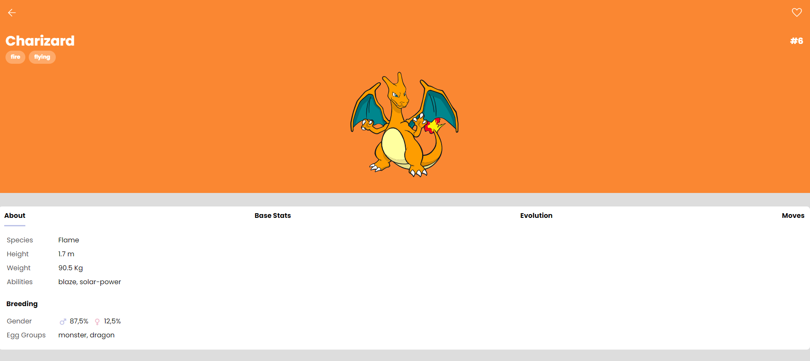

# Pokédex

Uma Pokédex simples que exibe informações sobre Pokémon usando a API PokeAPI.


## Visão Geral

Este projeto é uma Pokédex básica que permite aos usuários ver informações sobre vários Pokémon. Ele consome dados da [PokeAPI](https://pokeapi.co/) para exibir detalhes sobre Pokémon, como nome, número, tipo, habilidades, e mais.

 

## Como Usar

1. Clone o repositório:

   ```shell
   git clone https://github.com/LoganErick/js-developer-pokedex

Abra o arquivo index.html em um navegador da web para iniciar a Pokédex.


Você verá uma lista de Pokémon com números e nomes. Clique em um Pokémon para obter mais detalhes.

Explore as informações detalhadas do Pokémon, incluindo tipos, altura, peso, habilidades, taxa de gênero e muito mais.

Para carregar mais Pokémon, clique no botão "Load More" na parte inferior da lista.

Tecnologias Usadas
Este projeto utiliza as seguintes tecnologias:

HTML5
CSS3
JavaScript
Além disso, ele faz uso da API PokeAPI para buscar informações sobre Pokémon.

Autores
Seu Nome (@seu-usuario)
Licença
Este projeto está sob a licença MIT. Consulte o arquivo LICENSE para obter detalhes.

Este projeto foi criado como parte de um exercício de aprendizado e não está associado à The Pokémon Company International.